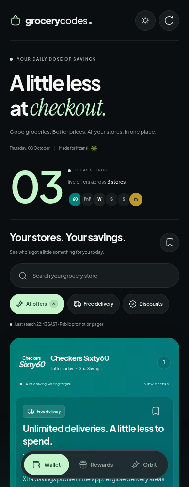
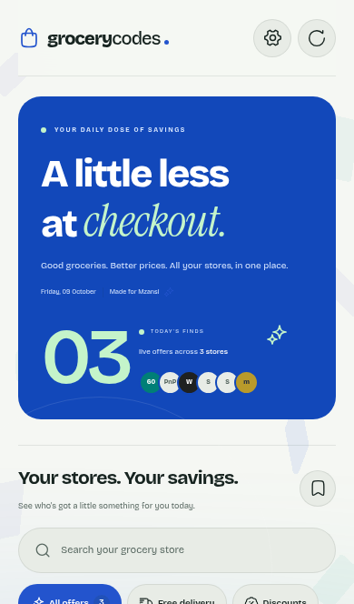
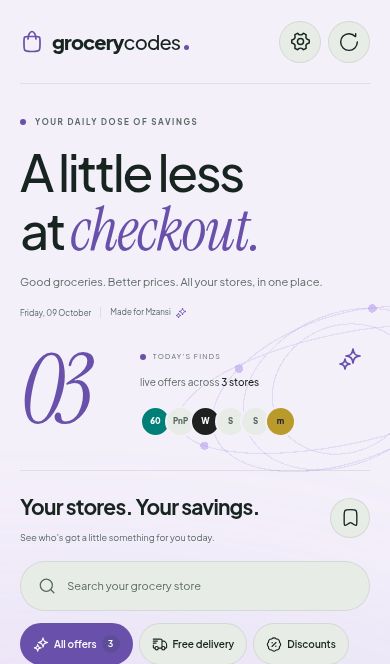

# Little Less

**A little less at checkout.**

A mobile-first app for finding South African grocery promotions, reading the terms, and copying a code in one tap. Built with **Next.js 16, React 19, TypeScript, Tailwind CSS 4, Motion, Three.js, Hugeicons, oxlint, oxfmt and pnpm**.

Three working designs are included. Open the header's settings gear to choose a view from illustrated previews, set a light, dark or system theme, and control animated backgrounds. The mobile sheet can be swiped down to close; desktop uses a side panel. Your preferences and saved offers persist in your browser.

| Wallet · default                                                                        | Rewards                                                                                   | Orbit                                                                                 |
| --------------------------------------------------------------------------------------- | ----------------------------------------------------------------------------------------- | ------------------------------------------------------------------------------------- |
| Stacked brand-colour cards, mint accents and a dark canvas.                             | A bright blue hero, generous offer tiles and a light theme.                               | Editorial serif typography and a swipeable store carousel.                            |
|  |  |  |

[Brand guidelines](docs/brand.md) · [Compare the designs](docs/designs.md) · [Settings preview](docs/previews/settings-phone.png) · [Desktop preview](docs/previews/wallet-desktop.png)

## Install and use offline

Open settings to install the app on a phone or desktop. Supported browsers offer an **Install app** button; on iPhone and iPad, settings explains **Share → Add to Home Screen → Add**. Installation requires HTTPS in production (localhost is supported for development). The app includes 192px and 512px launcher icons, a separate maskable icon, an Apple touch icon, an install screenshot and shortcuts for delivery, discounts and saved offers.

After the first online visit, settings shows **Ready offline** when both the app shell and offer snapshot are saved. The installed app can cold-launch without a connection. Search, filters, store details, bookmarks, copying, themes and view switching continue to work. Expired promotions and records past their 24-hour freshness deadline stay hidden, including offline; an empty offline list never claims there are new offers. Discovery, source pages and reports need a connection. Reconnection loads current listings automatically, with a manual retry available.

Each production build generates a versioned service worker from the actual Next.js assets. It precaches a clean `/offline` shell, scripts, styles, fonts, icons and theme manifests; offer snapshots live separately in IndexedDB. It does not cache live HTML, API responses, RSC payloads, POST requests or retailer pages. A failed precache does not activate, and its partial cache is removed. The last working build remains available to older open tabs. An **Update now / Later** notice lets users choose when to reload; bookmarks and preferences survive updates. Development mode does not register the worker.

[Installation controls](docs/previews/pwa-settings-phone.png) · [Offline preview](docs/previews/offline-phone.png)

## SEO, AI discovery and production readiness

Public store pages at `/stores` and `/stores/checkers` (plus the other five store IDs) render qualifying criteria, exact expiry/review times and source links without JavaScript. `/about` explains the evidence and expiry policy; `/privacy` documents device storage, reports and external services. Footer links make these pages discoverable.

Set `SITE_URL` to the public HTTPS origin and `INDEXING_ENABLED=true` on production to enable canonical URLs, Open Graph/Twitter sharing, robots and the ten-page sitemap. On Vercel, the stable `VERCEL_PROJECT_PRODUCTION_URL` is the automatic fallback and indexing defaults on only for `VERCEL_ENV=production`; an explicit `INDEXING_ENABLED` overrides this. Other hosts and previews default to noindex and an empty sitemap. The app never substitutes a guessed domain or request Host for a canonical. Structured data describes the website/application and breadcrumbs without invented ratings or prices.

`/llms.txt` links to current information; `/promotions.md` provides request-time Markdown with the same expiry/freshness filtering as the UI. Records include source evidence links, qualifying criteria and validity deadlines. These are discovery aids, not a guarantee of search or AI-answer ranking.

`pnpm check:production` verifies required public URL, operator contact, scheduler secret and storage/provider configuration without printing credentials. `/api/health` checks storage readiness. [Directory preview](docs/previews/store-directory-phone.png) · [Store details](docs/previews/store-details-phone.png) · [Social card](docs/previews/social-card.png)

[Privacy and security audit](docs/security-audit.md) · [Production launch guide](docs/production.md) covers deployment, scheduling, privacy, monitoring, indexing and remaining operator steps.

[CI/CD and repository protection](docs/repository-automation.md) documents required checks, Dependabot, CodeQL, secret scanning, CodeRabbit/GitGuardian connections and candidate deployment/promotion. [Contributing](CONTRIBUTING.md) explains the pull-request workflow. GitGuardian and CodeRabbit are connected; server protection and production promotion require owner-side setup.

## Run locally

Use Node.js 24 and pnpm 11.19.0:

```sh
pnpm install --frozen-lockfile
cp .env.example .env.local
pnpm dev
```

Open `http://localhost:3000`. You can link directly to `/?design=wallet`, `/?design=rewards` or `/?design=orbit`. Dark, light and system themes are supported; dark is the initial default. Rewards switches to light when selected, and settings can change it.

The document canvas, page, loading skeleton, browser theme colour and install manifest share the active background. A small inline head script applies saved preferences before React loads and keeps browser metadata in sync with theme and design changes. Light Orbit uses its lavender canvas throughout. Dynamic viewport heights and safe-area insets cover mobile browser bars, notches and landscape layouts. Browser chrome and installed splash-screen behaviour still depend on platform support; existing installs may keep their original launch colour until their manifest updates.

For a production Node server:

```sh
pnpm build
pnpm start
# Optional port:
pnpm start --port 4000
```

The build prepares Next's standalone server and its static assets. The start script loads standard production environment files and keeps local data outside the build directory.

## Promotion data and discovery

The attached prototype contains placeholder coupon codes. **None of those codes are used in live results.** The initial data is a small, manually reviewed primary-source snapshot of recurring benefits, reviewed on 8 October 2026. Each record has a 24-hour freshness deadline; stale records disappear unless a successful source check renews them. An ongoing benefit is explicitly labelled with no listed end date. Availability depends on the retailer's terms and checkout.

The initial snapshot includes Checkers Xtra Savings Plus delivery, Woolworths MyDifference PLUS online delivery, and Makro's senior food discount. Woolworths online delivery is not presented as confirmed Dash free delivery. Offers requiring membership show that requirement. Stores without a confirmed offer remain visible at the bottom.

**Without API keys:** refresh checks configured public retailer pages, revalidates the known recurring benefits when their evidence is found, and records which sources could be read. This mode does not perform broad internet search or extract arbitrary new coupon codes. Retailer anti-bot protections, JavaScript-only pages and robots restrictions can make a source unavailable. Partial results retain still-fresh listings without extending their freshness deadline.

**To discover new offers across the web**, configure both search and extraction:

```dotenv
SEARCH_PROVIDER=tavily
TAVILY_API_KEY=your_server_only_key
OPENAI_API_KEY=your_server_only_key
EXTRACTION_MODEL=gpt-4.1-mini
```

The pipeline queries Tavily for each store, checks candidate URLs against the supported retailer/voucher-domain list, honours robots rules, and reads accessible public pages with timeouts and size limits. OpenAI extracts strict JSON-schema offers with a 4,000-token response cap; Zod validates them. Discovery has a 90-second overall deadline propagated to source and provider requests. Verbatim evidence must exist in the fetched page, a coupon must appear in its code evidence, and expiry must be supported. Unknown-expiry promotions and expired offers are excluded. An explicitly recurring membership benefit may have a null expiry. LLM extraction is evidence-checked but still requires human review for unusual terms; it does not test checkout.

All discovered codes are marked **not tested at checkout**. The app never generates or silently guesses a coupon code. Date-only expiry is interpreted as 23:59:59.999 in `Africa/Johannesburg` (UTC+2). Offers are deduplicated by retailer plus code or title. Every listing links to its source, shows its last review time, and supports reporting a problem.

## API

| Endpoint                                | Behaviour                                                                                                                                                                                                               |
| --------------------------------------- | ----------------------------------------------------------------------------------------------------------------------------------------------------------------------------------------------------------------------- |
| `GET /api/offers?filter=all&q=checkers` | Fresh, unexpired offers. Filters: `all`, `free_delivery`, `discount`. Search matches retailer and loyalty names.                                                                                                        |
| `POST /api/refresh`                     | Checks public sources and optionally web-search candidates. Returns offers, new IDs and per-store source status. Client and shared discovery limits apply; concurrent server discovery within a process shares one job. |
| `POST /api/report`                      | Saves a report for an existing listing. Body: `{ "offerId": "...", "reason": "The code didn't work" }`. Also accepts `The offer has ended` and `The terms are different`.                                               |
| `GET /api/cron`                         | Authenticated discovery. Header: `Authorization: Bearer <CRON_SECRET>`.                                                                                                                                                 |

Refresh and reports validate browser origin. Set `TRUST_PROXY=true` only when the deployment ingress overwrites `x-forwarded-for`; otherwise all local clients share a conservative refresh bucket. No raw IP addresses are stored by the app. Set a separate `RATE_LIMIT_SECRET` (32+ random characters) in production; address identifiers use daily rotating HMACs. Public discovery has a shared ten-minute cooldown. Reports are removed after 30 days during the next report write or scheduled cleanup, using the updated service-role-only Supabase RPCs. Apply the current `supabase/schema.sql` before enabling writes. The single-node development limiter is in memory; Supabase provides an atomic distributed limiter.

API responses are excluded from indexing and use `no-store`. Reports have a 2KB streamed-body limit, JSON validation and safe error responses. Browser mutations accept the configured origin behind ingress and reject cross-site requests.

## Persistence

For local development or a single Node server, the app writes cache and reports to `.data/` using atomic cache-file replacement. Set `DATA_DIR` to a persistent volume in production. Without a persistent volume, data can be lost when an instance restarts.

For serverless or multiple instances, run [`supabase/schema.sql`](supabase/schema.sql), then set:

```dotenv
SUPABASE_URL=https://your-project.supabase.co
SUPABASE_SERVICE_ROLE_KEY=your_server_only_service_role_key
```

This stores the shared offer cache, reports and rate limits in Postgres through Supabase REST. Row level security is enabled; clients cannot read or mutate these tables. Reports are stored for review in `promotion_reports` or `.data/reports.jsonl`; there is no admin dashboard in this version.

## Scheduled discovery and deployment

A Dockerfile is included for a Node deployment. Mount `/app/.data` on a persistent volume, or configure Supabase. Provide discovery secrets at runtime, not during the build. A static-only host cannot run the discovery APIs.

The GitHub discovery workflow runs every six hours after you set repository variable `APP_URL` to the deployed origin and secret `CRON_SECRET` to the same value used by the server. It is skipped while `APP_URL` is unset. You can also schedule the authenticated endpoint with your hosting provider. No hosting account or provider API keys are bundled in this repository.

## Quality checks

```sh
pnpm check:production # Check deployment configuration before launch
pnpm check       # oxlint, oxfmt, TypeScript and Vitest
pnpm build
pnpm exec playwright install --with-deps chromium firefox webkit
pnpm test:e2e
```

Browser tests use an isolated server on port 3100 and temporary fixtures in `.data/e2e`. Their coupon is test-only and never enters production sources. Set `PLAYWRIGHT_CHROMIUM_EXECUTABLE_PATH` when using an existing Chromium binary.

Tests cover expiry/freshness, South African dates, deduplication, source boundaries and evidence; mobile and desktop tests cover search, filters, accordion behaviour, copy, saved offers, reports and refresh limits. Settings checks cover saved choices, focus return, Escape, sheet dragging, small and landscape screens, and changes to the device's motion preference. Automated axe checks scan all three designs in both themes on mobile and desktop, including the settings panel. Appearance and settings checks also run in Firefox and mobile WebKit. Software WebGL checks in Chromium verify all three scenes, a single canvas, context-loss recovery and the sparkle action; every engine tests the no-WebGL fallback. A GitHub CI workflow runs these checks on pushes and PRs.

PWA tests enable real service workers and drop network connections at an isolated local origin, covering cold launches, expired and corrupted snapshots, reconnecting, install controls, launch shortcuts, native sharing and explicit worker updates in Chromium, Firefox and WebKit. Ordinary UI tests block workers so network mocks remain isolated. Unit tests verify worker caching boundaries, outage fallback, previous-build retention and failed installation cleanup. Production tests cover canonical/preview isolation, structured-data escaping, AI feed expiry, strict extraction evidence, report byte limits, readiness and crawler/social endpoints. Store and information pages are checked without JavaScript and with automated accessibility scans.

## Design and accessibility

The UI follows the attached Wallet handoff and card references: overlapping store cards, clear offer counts, full-width copy actions, no-code states, brand-responsive ambient colour, and a calm count-up. Hugeicons provide interface icons throughout; the grocery bag remains a custom illustration. Motion adds gentle pointer tilt, spring filters, press feedback, copy checkmarks and bookmark pops. Saving or copying an offer sends a small pulse through the background; the sparkle beside today's count invites the same delight. Pull-to-refresh distinguishes vertical movement from a horizontal carousel swipe.

Each view has its own transparent Three.js scene over the shared page colour: soft ribbons for Wallet, floating rounded tiles for Rewards, and orbiting rings for Orbit. The renderer loads separately after the useful content paints and the browser has idle time, caps rendering at 30fps and pixel ratio at 1.25 on phones or 1.5 on larger screens, and pauses in hidden tabs. Geometry and listeners are disposed when disabled. Reduced-motion and data-saving visits skip the renderer; unavailable WebGL keeps the static ambient background. All motion respects `prefers-reduced-motion`, including preference changes during a visit.

Controls are labelled; search and filters work on small screens; dialogs use native focus trapping, Escape and Back dismissal; keyboard focus is visible. Search inputs use 16px text on touch devices to avoid automatic iPhone zoom, while pinch zoom remains available. Installed mode respects safe areas, limits overscroll and adapts to the onscreen keyboard. Share actions use the system share sheet when available, with a clipboard fallback. Supported installed platforms can show the current offer count as an app badge. Saved offers and preferences stay on the device. Push notifications and background discovery are not enabled; the scheduled server discovery remains separate from offline browsing.

Fonts are self-hosted Plus Jakarta Sans, Bricolage Grotesque and Instrument Serif, with their OFL licences in `public/fonts`. Retailer names are rendered as typographic identifiers and fallbacks rather than claiming to be official logo assets. Verified retailer-supplied SVGs can replace `StoreMark` when provided. Retailer names and marks belong to their owners; the app is independent and uses no affiliate links.
